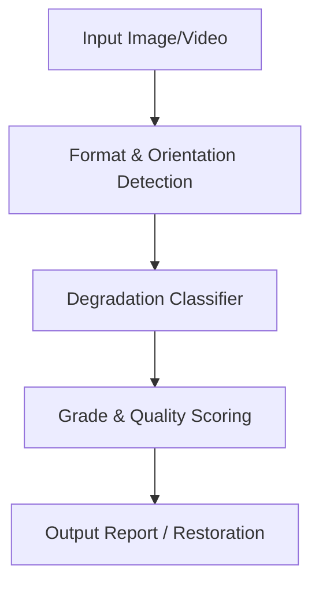

# Architecture & Models

## Overview

The Artefex pipeline runs in four main stages, applying targeted ONNX models to assess and reverse media degradation chains.

## Model Inventory

Our models are optimized for inference and typically operate on fixed-size tensors (e.g., `256x256x3` or `512x512x3`).

- **`detect_jpeg_blocks.onnx`**
  - **Purpose:** Detects blocking artifacts from aggressive JPEG compression.
  - **Input Shape:** `(1, 3, 256, 256)`
  - **Output:** Float score (0.0 to 1.0) indicating compression severity.

- **`chroma_blur.onnx`**
  - **Purpose:** Identifies chroma subsampling degradation.
  - **Input Shape:** `(1, 3, 256, 256)`
  - **Output:** Subsampling probability vector.

- **`stego_detector.onnx`**
  - **Purpose:** Highlights LSB steganography anomalies.
  - **Input Shape:** `(1, 1, 512, 512)` (Grayscale analysis)
  - **Output:** Anomaly confidence map.

## Degradation Taxonomy

The system maps artifacts into specific taxonomy classes:

- **Compression Artifacts:** JPEG blocking, mosquito noise, quantization errors.
- **Color Degradation:** Chroma subsampling blur, color banding.
- **Noise:** Gaussian noise, salt-and-pepper.
- **Anomalies:** Steganographic LSB manipulation, structural inconsistencies.

## Adding a New Artefact Class

1. **Train an ONNX model:** Generate synthetic data and train a classifier (see `train/`). Export as `.onnx`.
2. **Register the model:** Add the new model path and tensor specifications to `src/artefex/models_registry.py`.
3. **Add the analysis pipeline:** Create a new detector module in `src/artefex/` (e.g., `detect_new_artifact.py`).
4. **Update the CLI:** Add the new target flag in `src/artefex/cli.py`.
